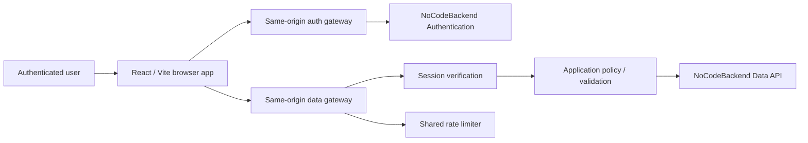

# ARCHITECTURE.md

## Purpose

This document is a concise project-level architecture map for Pourfolio. The repository's detailed `docs/ARCHITECTURE.md` remains the canonical technical reference.

## System context

## Core architectural rule

The production architecture is:

**Browser → application-owned server/API layer → NoCodeBackend**

Direct browser-to-NoCodeBackend access is not the supported production integration pattern.

The browser may request an operation, but the server owns provider credentials, authenticated identity, ownership and permissions, field allowlists, rating-total derivation, validation/normalisation, provider error mapping, rate limiting, correlation IDs and response projection.

## Frontend

The application is a React single-page application built with Vite. `src/App.jsx` is authoritative for currently reachable browser routes.

Current authenticated routes include:

- `/home` and `/search`;
- `/products/:productId`, `/products/:productId/rate`, `/products/propose`, and `/products/:productId/propose-edit`;
- `/places` and `/breweries/:producerId`;
- `/styles` and `/styles/:styleId`;
- `/taste-map`;
- `/cellar`, `/history`, `/profile`, `/settings`, and `/users/:publicProfileId`.

`/login` is the unauthenticated entry route. Public document routes are generated from `src/data/publicDocuments.js`.

`/brew-done-it` is present in source routing but remains a separately governed, fail-closed capability: production usability depends on its server-side policy/provider-certification boundary and it must not be represented as launch-ready merely because a browser route exists.

Reachability and launch readiness are separate concepts. Prototype source that is not routed must not be represented as an available product capability, while routed capabilities that are policy-disabled or dependency-gated must be documented as such.

## Browser response boundary

Successful provider/gateway JSON is not trusted merely because HTTP status is 200. Catalogue, producer, style and product responses are validated for envelope/pagination coherence, stable identities, render-safe fields, relationship consistency, aggregate-only projections and requested-route identity. Malformed successful responses enter recoverable error states rather than partially rendering.

## Authentication boundary

`api/auth-proxy.js` is the application authentication gateway. It owns the action/method allowlist, server-only provider credential injection, session cookie forwarding, unsafe-origin validation, request-size controls, upstream timeout/error handling, cookie rewriting, safe error projection, provider discovery and authentication rate limiting.

Provider discovery is authoritative. Provider failure must produce an unavailable/deployment state rather than silently pretending password authentication is available. Successful password sign-in, sign-up or OTP verification must resolve a stable user; acknowledgement without identity requires the governed session fallback and a missing/malformed session is failure.

## Data boundary

`api/data-router.js` is the canonical application data dispatcher. Launch resources are delegated to schema-aware handlers. Approved-but-separately-governed Brew Done It traffic is isolated in `api/_lib/brewDoneItGateway.js` and remains fail-closed unless its server-only policy flag is deliberately enabled after provider certification.

The data layer verifies private-session identity, derives ownership server-side, strips browser-supplied authority fields, allowlists collections/operations, verifies ownership and relationships, projects only permitted public/owner data and assigns safe correlation IDs.

## NoCodeBackend configuration

Standard server variables:

- `NOCODEBACKEND_AUTH_BASE_URL`
- `NOCODEBACKEND_DATA_BASE_URL`
- `NOCODEBACKEND_AUTH_SECRET_KEY`
- `NOCODEBACKEND_SECRET_KEY`
- `NOCODEBACKEND_INSTANCE`

Canonical URL defaults where required are `https://app.nocodebackend.com/api/user-auth` for authentication and `https://api.nocodebackend.com/` for data. Provider credentials and instance identifiers are runtime-owned and must not be committed or exposed to browser code. Legacy `NCB*` names are deprecated unless a documented compatibility boundary explicitly requires them.

## Rate limiting

Sensitive authentication paths use a shared Redis-compatible store. No raw credentials/tokens/request bodies are stored in rate-limit keys; account/client dimensions are normalised and HMACed; policy buckets are operation-specific; missing configuration is distinguishable from provider/store outage; production fails closed when required shared limiting is unavailable.

## Rating write integrity

A rating is a coordinated write across `ratings`, `rating_scores` and optional `bonus_attribute_rating_mapping` rows. The durable target uses an idempotent submission contract so retries cannot create duplicate logical ratings or partial child graphs.

The currently deployed schema must not be assumed to support the full target until #165's required fields, uniqueness semantics, migration/backfill procedure and recovery evidence are verified. `/ratings/reconcile` must remain unavailable until that durability contract is actually deployed and certified.

## Account lifecycle

The repository contains server-side foundations for export and deletion planning, but these do not yet constitute an executable whole-account lifecycle. Recent-authentication evidence, consistent provider snapshots, durable orchestration/write fencing, provider-backed deletion, authentication-identity deletion, final absence proof, retention/legal policy and connected accessible UI evidence remain future work.

## Brew Done It containment

The persistent two-account/two-device architecture and deduction-board model are approved in ADRs 0002 and 0006, but provider schema/permissions and connected privacy/recovery evidence remain separate enablement gates. `api/_lib/brewDoneItGateway.js` is the governed application boundary. The capability must remain fail-closed until its provider-certification requirements are satisfied.

## Deployment

Vercel provides SPA direct-route handling, serverless API functions, production environment variables, security headers and immutable hashed-asset caching. BonoHost is also supported through the host-neutral Node runtime path. `/api/health` is configuration/liveness evidence only and must not be represented as complete upstream readiness proof.

## Architectural non-negotiables

- No production provider secret in the client.
- No browser-selected user ownership.
- No client-side-only authorisation.
- No unsupported collection proxy.
- No fake success.
- No provider payload accepted without projection/validation.
- No schema assumption treated as deployed fact without evidence.
- No destructive lifecycle exposed before its end-to-end security and recovery contract exists.
- No Brew Done It secret beer in an active-round response to the guesser.
