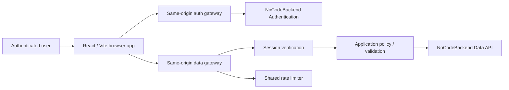

# ARCHITECTURE.md

## Purpose

This document is a concise project-level architecture map for Pourfolio. The repository's detailed `docs/ARCHITECTURE.md` remains the canonical technical reference.

## System context

## Core architectural rule

The production architecture is:

**Browser → application-owned server/API layer → NoCodeBackend**

Direct browser-to-NoCodeBackend access is not the supported production integration pattern.

The browser may request an operation, but the server owns:

- provider credentials;
- immutable authenticated identity;
- owner selection;
- role / permission authority;
- field allowlists;
- rating total derivation;
- validation and normalisation;
- provider error mapping;
- rate limiting;
- correlation IDs;
- response projection.

## Frontend

The launch app is a React single-page application built with Vite.

Reachable launch routes are limited to the supported beer-first product:

- `/login`
- `/home`
- `/search`
- `/products/:productId`
- `/products/:productId/rate`
- `/cellar`
- `/profile`

Prototype modules must not become launch routes merely because their source remains in the repository.

## Browser response boundary

Successful provider/gateway JSON is not trusted merely because HTTP status is 200.

Catalogue and product responses are validated before entering render state for:

- envelope shape;
- pagination coherence;
- stable positive identifiers;
- unique page identities;
- primitive render-safe fields;
- producer/category relationship consistency;
- aggregate-only rating summaries;
- requested-route identity matching.

Malformed successful responses must enter ordinary recoverable error states rather than partially render or crash.

## Authentication boundary

`api/auth-proxy.js` is the application authentication gateway.

Responsibilities include:

- fixed action/method allowlist;
- server-only provider secret injection;
- session cookie forwarding;
- unsafe-origin validation;
- request-size controls;
- upstream timeout/error handling;
- cookie rewriting for the Pourfolio deployment;
- safe error projection;
- provider discovery;
- authentication rate limiting.

Provider discovery is authoritative. A provider failure must produce an unavailable/deployment state rather than silently pretending password authentication is available.

Successful password sign-in, sign-up or OTP verification must resolve a stable user. If the provider returns an acknowledgement without session identity, the client must perform one `/get-session` fallback and treat a missing/malformed session as failure.

## Data boundary

`api/data-router.js` is the canonical application data dispatcher. Launch resources are delegated to schema-aware handlers. Approved-but-deferred Brew Done It traffic is isolated in `api/_lib/brewDoneItGateway.js` and remains fail-closed unless its server-only policy flag is deliberately enabled after provider certification.

The data layer:

- verifies a session on every private data request;
- derives owner identity server-side;
- strips browser-supplied identity, role, secret and authoritative total fields;
- allowlists collections and operations;
- verifies ownership before update/delete;
- validates relationship integrity;
- returns public or owner-specific projections only;
- assigns safe correlation IDs.

## NoCodeBackend configuration

Standard server variables:

- `NOCODEBACKEND_AUTH_BASE_URL`
- `NOCODEBACKEND_DATA_BASE_URL`
- `NOCODEBACKEND_SECRET_KEY`
- `NOCODEBACKEND_INSTANCE`

Canonical values where defaults are required:

- auth base: `https://app.nocodebackend.com/api/user-auth`
- data base: `https://api.nocodebackend.com/`
- instance: `54026_rating`

Any legacy `NCB*` variable name should be treated as deprecated unless a documented compatibility layer explicitly requires it.

## Rate limiting

Sensitive authentication paths use a shared Redis-compatible store provisioned through Vercel.

Requirements:

- no raw email/password/OTP/token/request-body storage;
- account/client dimensions are normalised and HMACed;
- separate policy buckets for sign-in, sign-up, OTP and general operations;
- missing configuration is distinguishable from provider/store outage;
- production fails closed when shared rate limiting is unavailable.

## Rating write integrity

A rating is a coordinated write across:

- `ratings`;
- `rating_scores`;
- optional `bonus_attribute_rating_mapping`.

The durable target uses an idempotent submission contract so retries cannot create duplicate logical ratings or partial child graphs.

The currently deployed schema must not be assumed to support the full target until the required fields and provider semantics are verified. Reconciliation routes must remain disabled or fail safely when the durability contract is not actually deployed.

## Account lifecycle

The repository contains pure server-side source foundations for:

- portable export manifest projection;
- deterministic export artifact creation;
- account-deletion discovery planning;
- count-only deletion reconciliation;
- exact deletion confirmation text validation.

These are not currently an executable whole-account lifecycle.

Missing approval / implementation includes:

- recent-authentication evidence;
- consistent multi-collection provider snapshot semantics;
- durable server-side job orchestration;
- write fencing;
- provider-backed delete execution;
- authentication identity deletion;
- final absence proof;
- retention / legal policy;
- accessible UI and connected evidence.

## Brew Done It containment

Current state:

- no launch route;
- no launch navigation item;
- `BREW_DONE_IT_POLICY_ENABLED` remains unset in normal deployments;
- persistent provider collections remain deferred/not provider-certified.

Accepted future state under [ADR 0002](docs/DECISIONS/0002-approve-brew-done-it-cross-device.md):

- two authenticated Pourfolio users on separate devices;
- a persistent two-player series containing repeated beer-challenge rounds;
- the selector chooses a catalogue beer before the challenge is shared;
- the guesser never receives the secret beer identity while the round is active;
- controlled public-catalogue yes/no questions and exact beer guesses;
- server-derived 0–10 round scoring;
- durable round history and head-to-head statistics across sessions;
- selector/guesser roles swap for each subsequent round by default;
- optimistic versioning and idempotency protect asynchronous play.

`api/_lib/brewDoneItGateway.js` contains the approved application boundary, while the older implementation in `api/data-proxy.js` remains legacy/quarantined source. The new capability may merge while disabled, but route/navigation and the policy flag must not be enabled until the schema and connected two-device evidence satisfy the migration gate in `docs/nocodebackend/brew-done-it-schema-target.md`.

## Deployment

Vercel provides:

- SPA direct-route handling;
- serverless API functions;
- production environment variables;
- security headers;
- immutable hashed-asset caching.

`/api/health` is a configuration/liveness signal only and must not be represented as complete upstream readiness proof.

## Architectural non-negotiables

- No production provider secret in the client.
- No browser-selected user ownership.
- No client-side-only authorisation.
- No unsupported collection proxy.
- No fake success.
- No provider payload accepted without projection / validation.
- No schema assumption treated as deployed fact without evidence.
- No destructive lifecycle exposed before its end-to-end security and recovery contract exists.
- No Brew Done It secret beer in an active-round response to the guesser.
