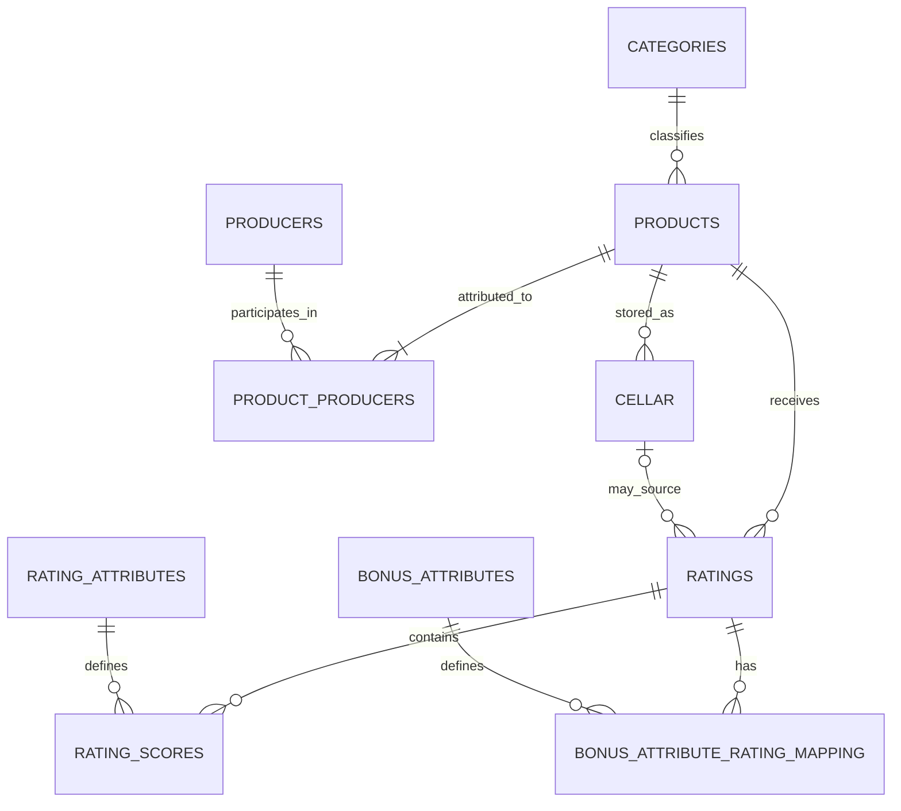

# DATA_MODEL.md

## Purpose

This is the project-level data model summary. The detailed repository contract in `docs/DATA_MODEL.md` and `docs/nocodebackend/schema-mapping.md` remains authoritative for field-level implementation. `docs/nocodebackend/launch-schema-contract.md` is the concise launch classification that distinguishes deployed-required, deployed-optional, deferred-target and unavailable fields/capabilities.

## Provider instance

**NoCodeBackend instance:** `54026_rating`

The launch code must use deployed schema facts rather than proposed target fields that are not yet present.

## Launch contract classification

Use `docs/nocodebackend/launch-schema-contract.md` when deciding whether an application service may require a provider field. Repository-supplied provider exports and governed owner-confirmed provider changes may establish the current structural contract without being described as fresh live introspection.

- **DEPLOYED_REQUIRED** fields/collections may be required by the active launch boundary.
- **DEPLOYED_OPTIONAL** fields must remain nullable/enrichment-only where the contract allows absence.
- **DEFERRED_TARGET** fields must remain disabled until governed provider migration and connected verification complete.
- **UNAVAILABLE** capabilities must fail explicitly or use an already-approved non-persistent behaviour rather than fabricated persistence.

The durable rating idempotency/concurrency fields tracked by #165 remain DEFERRED_TARGET. Persistent `profiles` storage remains UNAVAILABLE on current evidence.

## Core launch entities

## Canonical collection names

Launch paths use:

- `products`
- `producers`
- `product_producers`
- `categories`
- `ratings`
- `rating_scores`
- `rating_attributes`
- `bonus_attributes`
- `bonus_attribute_rating_mapping`
- `cellar`

Legacy names such as `beverages_pf2025`, `ratings_pf2025`, `cellar_items_pf2025` and `beverage_id` are not canonical launch identifiers.

The `product_producers` relationship table was owner-confirmed as deployed on 16 September 2026. It is authoritative for product-to-producer attribution for both single-producer products and collaborations. `products.producer_id` remains temporarily as a compatibility mirror of the primary producer while historical data is backfilled and dependent code is migrated.

## Ownership

Private user data is owner-scoped.

The browser must not authoritatively write:

- `user_id`;
- provider secrets;
- roles;
- authoritative rating totals;
- provider workflow metadata;
- `product_producers.product_id`;
- `product_producers.is_primary`;
- `product_producers.sort_order`.

Authenticated owner identity and relationship metadata come from the server-side application boundary.

## Products

`products` is the canonical beer catalogue entity.

Important relationships:

- `product_category_id` → `categories`
- `product_producers.product_id` → `products.id`
- `product_producers.producer_id` → `producers.id`
- transitional `products.producer_id` → primary `producers.id`

Launch behaviour depends on stable product identity. Product routes, provider responses and browser projections must agree on the requested product identifier.

For new application writes, `products.producer_id` must mirror the producer represented by the primary `product_producers` row. It is a migration fallback, not a second independent source of producer attribution.

Current data work includes reconciliation of orphaned producer/category references, historical `product_producers` backfill and deterministic browse ordering before catalogue certification.

## Producers and collaborations

A product has one or more producer relationships in `product_producers`.

Canonical fields are:

- `id`;
- `product_id`;
- `producer_id`;
- `is_primary`;
- `sort_order`.

The application relationship contract is:

- every new product receives at least one relationship row;
- exactly one relationship is primary for a product;
- the primary row uses `sort_order = 1`;
- additional collaborators use increasing sort order;
- the same `(product_id, producer_id)` pair cannot occur more than once;
- one producer means a normal product;
- two or more producers means a collaboration.

A sentinel producer ID such as `0` must never represent collaboration. Missing relationship data remains unresolved rather than being converted into fabricated producer data.

During the migration period, reads first query `product_producers`. Only when that lookup succeeds and returns zero rows may the application fall back to `products.producer_id`. A relationship-table read failure must fail closed rather than silently using legacy data and hiding collaborators.

New Add Beer writes persist all producer relationships and also keep `products.producer_id` synchronized with the primary producer. Once historical backfill, production read evidence and dependent-service migration are complete, the legacy producer column can be removed in a separate governed schema migration. The `collaboration` column can likewise be retired after all consumers derive collaboration status from relationship count.

## Categories

Categories form a hierarchy.

The canonical catalogue audit must verify:

- unique category IDs;
- valid parent references;
- no self-reference;
- no cycles;
- required ancestry to the launch root;
- deterministic relationships for every product.

## Ratings

`ratings` is the rating header.

Current deployed fields include:

- `product_id`;
- optional `cellar_id`;
- `date_rated`;
- `total_unweighted`;
- `total_weighted`.

Totals are server-authoritative.

A rating does not require a sharing series or edition.

## Rating scores

`rating_scores` stores normalised component scores linked to:

- one rating;
- one rating attribute.

The public catalogue must not expose individual private rating rows merely to compute product aggregate summaries.

## Bonus attributes

Optional bonus ratings use:

- `bonus_attributes`;
- `bonus_attribute_rating_mapping`;
- `bonus_attribute_rating_mapping.bonus_attributes_id`.

Bonus relationships are optional.

## Cellar

`cellar` is private owner data.

The supplied backend table contains the following application fields:

- `product_id`;
- `location_id`;
- `quantity`;
- `mls`;
- `container`;
- `purchase_price`;
- `retail_price`;
- `date_received`;
- `sharing_series_id`;
- `series_version_id`;
- `purchase_location_id`;
- `purchased_by_id`;
- `gift`;
- `gift_from`;
- `bet_id`;
- `notes`.

Provider/server-owned `id`, `secret_key` and `user_id` are not browser-authoritative writable fields.

The exported `cellar` table does **not** contain `status`, `quantity_acquired`, `date_consumed`, `acquisition_type` or `historical_import`. Launch code must not write or fabricate those fields.

Sharing-series / edition relationships are optional and must be null when not applicable.

A rating may optionally reference a cellar record, but rating validity must not depend on sharing-series metadata.

## Rating idempotency target

The durable target schema requires enough information to make coordinated rating writes retry-safe.

Target capabilities include:

- stable client submission identity;
- submission fingerprint;
- workflow state;
- expected child counts;
- deterministic child uniqueness keys;
- version / conditional update semantics;
- safe partial-write reconciliation.

These fields must not be treated as deployed until issue #165 is completed and provider behaviour is verified.

## Account export and deletion projections

The repository's account export and account-deletion structures are **in-memory server projections**, not new NoCodeBackend collections.

They do not alter the provider schema and must not be mistaken for deployed database tables.

## Migration rules

Any schema change must include:

- explicit deployed-field contract;
- compatibility assessment;
- backfill strategy where needed;
- uniqueness / constraint rollout sequencing;
- fixture and test updates;
- permission review;
- recovery / rollback or safe-forward consideration;
- updated schema mapping;
- connected-provider verification before dependent features are enabled.

## Data integrity rules

- Never invent missing producer/category mappings.
- Never use invalid sentinel IDs to model unresolved relationships.
- Preserve null separately from absent where the contract distinguishes them.
- Keep optional sharing-series relationships optional.
- Verify ownership before private mutation.
- Verify parent/child relationships before coordinated write completion.
- Do not declare imported or exported files canonical until reconciliation evidence exists.
