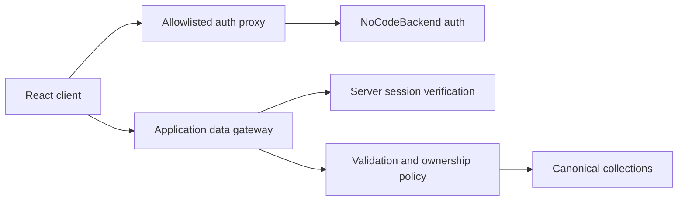

# Architecture

## Launch architecture

Pourfolio is a beer-first React/Vite single-page application deployed with same-origin serverless functions. The browser cannot select a backend collection, owner ID, role or authoritative rating total.

## Browser boundary

The reachable launch routes are:

- `/login`
- `/home`
- `/search`
- `/products/:productId`
- `/products/:productId/rate`
- `/cellar`
- `/profile`

Catalogue, product, rating, rating-history, cellar and profile operations use explicit services and same-origin `/api/nocodebackend/*` endpoints. The browser stores no authentication secret, private cellar record, role override, rating transaction or privacy policy state. Device-local browser storage remains only in unreachable prototype modules.

The launch client uses a small same-origin History API router in
`src/lib/router.jsx`. It intentionally supports only internal links, exact route
patterns and named path parameters; cross-origin navigation targets are rejected.
This avoids carrying a general-purpose router dependency with unresolved launch
advisories.

Chat, Drinking Buddies, events, venues, analytics, producer claims, administration, test-user switching, non-beer rating modes, privacy controls without enforcement, and photo upload are not routed or bundled into the launch application.

## Authentication boundary

`api/nocodebackend/auth/[...path].js` exposes a fixed action/method matrix. It adds the server-only provider secret, forwards the session cookie, validates unsafe request origins, limits request size and rate, times out upstream requests, and maps provider failures to safe errors. Upstream authentication cookies are rewritten as host-only, root-path cookies for the Pourfolio deployment and retain their expiry and explicit SameSite policy while always receiving `HttpOnly` and `Secure`.

Authentication throttling uses an Upstash Redis database provisioned through the
approved Vercel Marketplace integration. `api/_lib/rateLimit.js` performs one
atomic Redis script operation to increment a bucket and set its expiry. Sign-in,
OTP verification, sign-up and general operations have separate policies. Sensitive
operations combine Vercel's deployment-controlled client address with a normalised
account identifier, then HMAC the dimensions before storage. No email, password,
OTP, token or request body is stored. This direct REST implementation avoids a new
runtime dependency; changing provider or package requires architecture review.

Public sign-up supplies only email, password, name and non-authoritative display metadata. It cannot request producer or administrator access. Immutable identity must come from `id`, `user_id`, `userId` or `_id`; email alone is not accepted as identity.

## Data boundary

`api/nocodebackend/[...path].js`:

- verifies the session on every data request;
- uses server-only `NOCODEBACKEND_DATA_BASE_URL` and `NOCODEBACKEND_SECRET_KEY`;
- exposes only product catalogue/details, rating-form/submission/history, cellar and profile workflows;
- derives owner IDs from the session;
- verifies ownership again before update/delete or cellar linkage;
- strips browser-supplied identity, role, secret and total fields;
- projects every response through explicit public/owner field lists;
- assigns a correlation ID without logging request bodies or personal data.

The canonical data contract is [schema mapping](nocodebackend/schema-mapping.md).

## Rating integrity

Rating submission is a coordinated server operation across `ratings`, `rating_scores` and optional `bonus_attribute_rating_mapping`. A stable positive `rating_id` makes retries idempotent. Scores are complete 1–7 integers, current database weights calculate totals, and partial writes are deleted in reverse order after failure. Remote provider transaction support should replace compensation if it becomes available and is verified.

## Deployment

`vercel.json` provides SPA direct-route rewrites, security headers and immutable caching for hashed assets. Production source maps are disabled. `/api/health` reports only configuration booleans and never contacts upstream services or reveals secrets.

Required server variables:

- `NOCODEBACKEND_SECRET_KEY`
- `NOCODEBACKEND_DATA_BASE_URL`
- `UPSTASH_REDIS_REST_URL`
- `UPSTASH_REDIS_REST_TOKEN`
- `RATE_LIMIT_KEY_SECRET`

Optional server variables:

- `NOCODEBACKEND_AUTH_BASE_URL`
- `ALLOWED_ORIGINS`

## Remaining external controls

Source code cannot prove remote collection permissions, production environment values, import reconciliation, backup/restore, alert routing, legal text, account deletion/export or operational support ownership. These remain release gates in [Launch Readiness](LAUNCH_READINESS.md).
