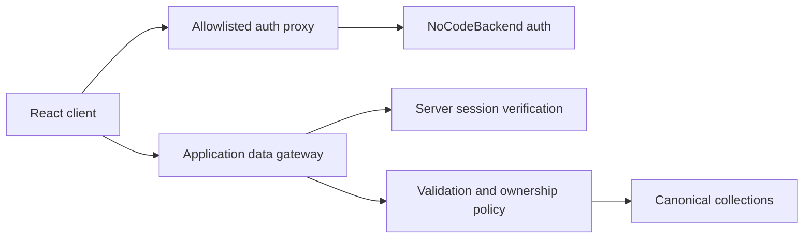
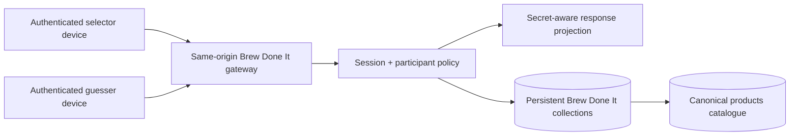

# Architecture

## Launch architecture

Pourfolio is a beer-first React/Vite single-page application deployed with same-origin serverless functions. The browser cannot select a backend collection, owner ID, role or authoritative rating total.

## Browser boundary

The reachable launch routes are:

- `/login`
- `/home`
- `/search`
- `/products/:productId`
- `/products/:productId/rate`
- `/cellar`
- `/profile`

Catalogue, product, rating, rating-history, cellar and profile operations use explicit services and same-origin `/api/nocodebackend/*` endpoints. The browser stores no authentication secret, private cellar record, role override, rating transaction or privacy policy state. Device-local browser storage remains only in unreachable prototype modules.

The launch client uses a small same-origin History API router in
`src/lib/router.jsx`. It intentionally supports only internal links, exact route
patterns and named path parameters; cross-origin navigation targets are rejected.
This avoids carrying a general-purpose router dependency with unresolved launch
advisories.

Chat, Drinking Buddies, events, venues, analytics, producer claims, administration, test-user switching, non-beer rating modes, privacy controls without enforcement, and photo upload are not routed or bundled into the launch application.

## Authentication boundary

`api/auth-proxy.js` is the authentication proxy. `api/data-router.js` is the
canonical data dispatcher and delegates launch resources to schema-aware
handlers. `vercel.json` maps the unchanged same-origin
`/api/nocodebackend/auth/*` and `/api/nocodebackend/*` interfaces to these flat
Vercel Functions before applying the SPA fallback. Vercel supplies each
`:path*` capture as `request.query.path` and retains the request’s other query
parameters for redirects, pagination, search and filtering.

`api/auth-proxy.js` exposes a fixed action/method matrix. It adds the server-only provider secret, forwards the session cookie, validates unsafe request origins, limits request size and rate, times out upstream requests, and maps provider failures to safe errors. Upstream authentication cookies are rewritten as host-only, root-path cookies for the Pourfolio deployment and retain their expiry and explicit SameSite policy while always receiving `HttpOnly` and `Secure`.

The browser treats provider discovery as authoritative and fail-closed: no
authentication method is exposed until a valid `/providers` response enables
it, and a discovery failure produces a visible unavailable state. Successful
password sign-in, sign-up and OTP verification must resolve a stable user. If
the action response is only an acknowledgement, the client performs one
`/get-session` fallback; an absent or malformed refreshed session is an error,
never a null success.

Authentication throttling uses an Upstash Redis database provisioned through the
approved Vercel Marketplace integration. `api/_lib/rateLimit.js` performs one
atomic Redis script operation to increment a bucket and set its expiry. Sign-in,
OTP verification, sign-up and general operations have separate policies. Sensitive
operations combine Vercel's deployment-controlled client address with a normalised
account identifier, then HMAC the dimensions before storage. No email, password,
OTP, token or request body is stored. This direct REST implementation avoids a new
runtime dependency; changing provider or package requires architecture review.

Public sign-up supplies only email, password, name and non-authoritative display metadata. It cannot request producer or administrator access. Immutable identity must come from `id`, `user_id`, `userId` or `_id`; email alone is not accepted as identity.

## Data boundary

The canonical `api/data-router.js` dispatches requests by explicit resource.
Launch data uses the schema-aware catalogue, cellar, current-data and profile
handlers. Brew Done It is isolated in `api/_lib/brewDoneItGateway.js`; although
its source implements the accepted future contract, it remains a deferred
capability and fails closed unless its server-only policy flag is enabled after
provider certification.

The data layer:

- verifies the session on every private data request;
- uses server-only `NOCODEBACKEND_DATA_BASE_URL` and `NOCODEBACKEND_SECRET_KEY`;
- exposes only explicitly routed workflows;
- derives owner and participant IDs from the session;
- verifies ownership/participation before private reads and writes;
- strips browser-supplied identity, role, secret and authoritative total fields;
- projects every response through explicit public/owner/participant field lists; and
- assigns a correlation ID without logging request bodies or personal data.

Successful catalogue JSON crosses a second, browser-side shape boundary before
React state. `src/services/catalogueResponse.js` allowlists the public page,
product, producer/category and aggregate-rating fields; proves pagination and
relationship coherence; rejects individual ratings and unrenderable values;
and returns a deeply frozen copy. Both reads in `beverageService` use the
boundary, so malformed HTTP 200 data follows the existing page-level
error/retry state instead of reaching render code. See the
[catalogue response contract](catalogue-response-contract.md).

The provider adapter binds paginated results to the exact requested page/size
and checks total-page/terminal-item arithmetic. Direct provider records must
match their requested ID, including the filtered-list fallback after a 404.
Product details repeat this comparison at the gateway and browser boundaries;
non-canonical browser route IDs fail before network access. These checks keep a
successful response for another page or product from being labelled with the
current route.

The canonical launch data contract is [schema mapping](nocodebackend/schema-mapping.md).
The approved deferred Brew Done It data target is
[Brew Done It schema target](nocodebackend/brew-done-it-schema-target.md).

## Account lifecycle boundary

`api/_lib/accountExport.js` is a pure server-side projection and validation
module for the future portable account export. Given one already-consistent
logical snapshot and a server-supplied account identity, it exact-matches owner
rows, validates rating/score/bonus/cellar relationships, selects only referenced
catalogue context, strips provider-only fields, sorts stable string IDs and
returns a versioned manifest with exact counts. It performs no provider read,
write, logging or network request.

`api/_lib/accountExportArtifact.js` composes only that validated manifest into
an immutable, deterministic in-memory UTF-8 JSON artifact. It fixes the ASCII
filename, JSON media type, `no-store`/attachment/`nosniff` metadata, byte length
and SHA-256 without using request or exported values in headers. It performs no
response write, storage, logging, provider operation or environment access.

`api/_lib/accountDeletionPlan.js` is the separate source-only whole-account
discovery boundary. Given the five owner-data collections, it exact-matches the
supplied server identity, validates owner relationships and returns immutable,
stable record IDs and counts in child-first order. It adds no separate
authentication-identity field and excludes every record body. It performs no
provider read, delete, job write, session operation, logging or network request.

`api/_lib/accountDeletionReconciliation.js` is the count-only follow-on
boundary. It strictly validates a deletion plan, reuses the discovery rules for
one later complete logical snapshot and compares identifiers only in memory. It
reports planned, removed, remaining and unplanned counts, with `complete` true
only when no later exact-owner records remain. It returns no record IDs and
performs no provider read, delete, job write, session operation, logging or
network request.

`api/_lib/accountDeletionConfirmation.js` is the exact-text boundary. It accepts
only a plain one-field request object containing the exact ASCII phrase, rejects
all browser identities/selectors and returns a frozen format/version/boolean
result without copying request text. It performs no request parsing,
authentication, provider operation, deletion, logging or network request.

None of these modules is imported by `api/auth-proxy.js`, the launch data
handlers, any browser service or any page. The current provider session contract
contains no verified recently-authenticated timestamp, and the current
collection API has no proved consistent multi-collection snapshot. Exposing any
module now would therefore create an incomplete security and data-consistency
boundary. The export endpoint criteria and portable fields are defined in the
[account export contract](account-export-contract.md); destructive-workflow
criteria are defined in the
[deletion-plan contract](account-deletion-plan-contract.md) and
[reconciliation contract](account-deletion-reconciliation-contract.md), with
exact text handling defined by the
[confirmation contract](account-deletion-confirmation-contract.md).

Recovery, explicit verification, session revocation and authentication-identity
deletion also remain absent from the fixed auth action matrix. Account-deletion
orchestration remains absent: the source-only confirmation, plan and count
reconciliation are not routes, authentication decisions, provider queries,
jobs, delete operations, final provider proof or receipts. A durable server-only
job store, write fence, provider identity operation and approved retention
policy remain required. The complete gate is tracked in the
[account lifecycle readiness review](account-lifecycle-readiness.md).

## Brew Done It containment boundary

Brew Done It remains absent from the launch route table and primary navigation.
The launch catch-all therefore prevents the retained page/service modules from
being loaded by production browser routing.

[ADR 0002](DECISIONS/0002-approve-brew-done-it-cross-device.md) supersedes the
old same-device decision and approves the following future architecture:

A persistent `brew_done_it_games` row represents the two-player series. Each
`brew_done_it_rounds` row is one beer challenge in that series. The selector
chooses a catalogue product before the initial challenge is shared. The first
round waits for the second authenticated account; after acceptance it becomes
an asynchronous guessing round. Completed/forfeited rounds remain in the series
ledger, and the previous guesser becomes selector for the next round by default.
The series remains active rather than terminating after one beer.

Question and guess actions are persisted. Base questions use controlled public
catalogue facts only; shared-rating-history predicates are not part of the
approved model. Guesses are exact catalogue beers. Round scoring is calculated
server-side under a versioned 0–10 contract and aggregate/head-to-head
statistics are derived from terminal round records.

The selected beer is a server-side projection boundary. During an active round
the selector may receive its selected product identifier, while the guesser
must not receive that identifier or equivalent answer data. On terminal round
state the beer may be revealed to both players. Role checks, optimistic versions
and idempotency keys protect asynchronous writes and retries.

The canonical router sends Brew Done It traffic to the dedicated
`api/_lib/brewDoneItGateway.js`, not the older game code retained inside
`api/data-proxy.js`. The older shared-history implementation remains quarantined
for regression/history only.

A second containment boundary remains server-side: every Brew Done It request
returns the ordinary not-found response before authentication/provider access
unless `BREW_DONE_IT_POLICY_ENABLED` is exactly `true`. Normal environments
leave the flag unset. The four target game collections remain in
`DEFERRED_COLLECTIONS` until the migration/certification gate in
[`nocodebackend/brew-done-it-schema-target.md`](nocodebackend/brew-done-it-schema-target.md)
is complete.

## Rating integrity

Rating submission is a coordinated server operation across `ratings`, `rating_scores` and optional `bonus_attribute_rating_mapping`. The delivery environment has no connected provider credentials or documented transaction endpoint, so atomic support is unverified. A stable owner/submission key, deterministic child keys, payload fingerprint, expected counts and `pending`/`complete`/`failed` state make retries and the owner-safe reconciliation route idempotent. Success is returned only after an exact owner-scoped child re-read; see the schema mapping for verification evidence and rollout controls. A single provider transaction should replace this workflow only after atomic commit and abort behaviour is proved in a production-equivalent environment.

## Deployment

`vercel.json` provides SPA direct-route rewrites, security headers and immutable caching for hashed assets. Production source maps are disabled. `/api/health` is the configuration-only liveness signal described in the [production operations runbook](OPERATIONS_READINESS.md): it reports only whether required configuration is present, never returns configuration values, never contacts upstream services and is not a readiness guarantee.

`UPSTASH_REDIS_REST_URL`, `UPSTASH_REDIS_REST_TOKEN` and
`RATE_LIMIT_KEY_SECRET` are server-only variables and must not use a `VITE_`
prefix. The Upstash client is initialised with `Redis.fromEnv()`. Authentication
fails closed when the shared store is unavailable; there is no in-memory
production fallback.

Shared-limiter HTTP 503 responses preserve a generic public message and a
correlation ID. The safe code `rate_limit_configuration_missing` is limited to
absent limiter key or Upstash URL/token configuration. Client initialisation,
command, connection and result-contract failures use
`rate_limit_service_unavailable`; their detailed category remains server-side
telemetry only.

Required server variables:

- `NOCODEBACKEND_SECRET_KEY`
- `NOCODEBACKEND_DATA_BASE_URL`
- `UPSTASH_REDIS_REST_URL`
- `UPSTASH_REDIS_REST_TOKEN`
- `RATE_LIMIT_KEY_SECRET`

Optional server variables:

- `NOCODEBACKEND_AUTH_BASE_URL`
- `ALLOWED_ORIGINS`

## Remaining external controls

Source code cannot prove remote collection permissions, production environment
values, import reconciliation, backup/restore, alert routing, legal text,
recently authenticated account export, account deletion or operational support
ownership. It also cannot prove the deferred Brew Done It provider schema or
cross-device secret-projection behaviour until those collections are created in
a connected environment. These remain release gates in
[Launch Readiness](LAUNCH_READINESS.md).
