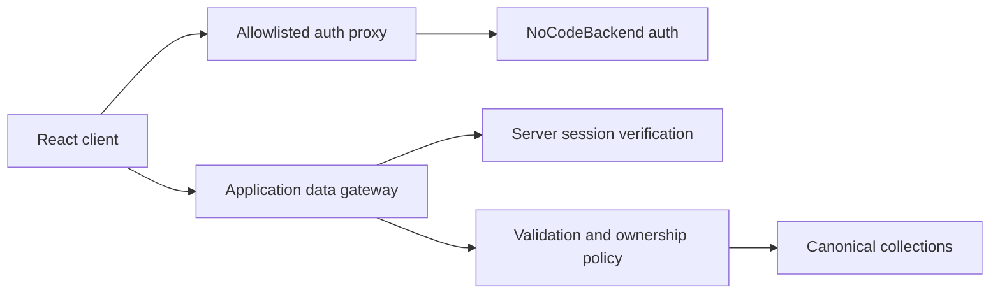

# Architecture

## Launch architecture

Pourfolio is a beer-first React/Vite single-page application deployed with same-origin serverless functions. The browser cannot select a backend collection, owner ID, role or authoritative rating total.

## Browser boundary

The reachable launch routes are:

- `/login`
- `/home`
- `/search`
- `/products/:productId`
- `/products/:productId/rate`
- `/cellar`
- `/profile`
- `/brew-done-it`

Catalogue, product, rating, rating-history, cellar and profile operations use explicit services and same-origin `/api/nocodebackend/*` endpoints. The browser stores no authentication secret, private cellar record, role override, rating transaction or privacy policy state. Device-local browser storage remains only in unreachable prototype modules.

The launch client uses a small same-origin History API router in
`src/lib/router.jsx`. It intentionally supports only internal links, exact route
patterns and named path parameters; cross-origin navigation targets are rejected.
This avoids carrying a general-purpose router dependency with unresolved launch
advisories.

Chat, Drinking Buddies, events, venues, analytics, producer claims, administration, test-user switching, non-beer rating modes, privacy controls without enforcement, and photo upload are not routed or bundled into the launch application.

## Authentication boundary

`api/nocodebackend/auth/[...path].js` exposes a fixed action/method matrix. It adds the server-only provider secret, forwards the session cookie, validates unsafe request origins, limits request size and rate, times out upstream requests, and maps provider failures to safe errors. Upstream authentication cookies are rewritten as host-only, root-path cookies for the Pourfolio deployment and retain their expiry and explicit SameSite policy while always receiving `HttpOnly` and `Secure`.

Authentication throttling uses an Upstash Redis database provisioned through the
approved Vercel Marketplace integration. `api/_lib/rateLimit.js` performs one
atomic Redis script operation to increment a bucket and set its expiry. Sign-in,
OTP verification, sign-up and general operations have separate policies. Sensitive
operations combine Vercel's deployment-controlled client address with a normalised
account identifier, then HMAC the dimensions before storage. No email, password,
OTP, token or request body is stored. This direct REST implementation avoids a new
runtime dependency; changing provider or package requires architecture review.

Public sign-up supplies only email, password, name and non-authoritative display metadata. It cannot request producer or administrator access. Immutable identity must come from `id`, `user_id`, `userId` or `_id`; email alone is not accepted as identity.

## Data boundary

`api/nocodebackend/[...path].js`:

- verifies the session on every data request;
- uses server-only `NOCODEBACKEND_DATA_BASE_URL` and `NOCODEBACKEND_SECRET_KEY`;
- exposes only product catalogue/details, rating-form/submission/history, cellar and profile workflows; catalogue details contain only a rating count and average, while owner-only `/ratings/mine` provides personal rating history;
- derives owner IDs from the session;
- verifies ownership again before update/delete or cellar linkage;
- strips browser-supplied identity, role, secret and total fields;
- projects every response through explicit public/owner field lists;
- assigns a correlation ID without logging request bodies or personal data.

The canonical data contract is [schema mapping](nocodebackend/schema-mapping.md).

## Brew Done It boundary

The protected, lazy-loaded Brew Done It route keeps orchestration in
`src/pages/BrewDoneIt.jsx` and presentation in focused invitation, selection,
round, question, guess, score and statistics components. Browser operations use
only the explicit `brewDoneItService` gateway methods. Secret selection,
current version, turn ownership, scoring and completion remain authoritative at
the gateway; the UI never sends an owner, outcome or points total.

The selected product is removed from interactive markup after selection. The
guesser's round projection omits its identifier until completion, and product
details are fetched for the reveal only after a completed projection supplies
that identifier. No game state is serialised to URLs or browser storage.
Bounded, user-triggered refresh and safe retry actions handle disconnection and
lost responses without introducing a realtime dependency. Stale versions,
expiry and terminal states are shown without provider details or private data.

## Rating integrity

Rating submission is a coordinated server operation across `ratings`, `rating_scores` and optional `bonus_attribute_rating_mapping`. The delivery environment has no connected provider credentials or documented transaction endpoint, so atomic support is unverified. A stable owner/submission key, deterministic child keys, payload fingerprint, expected counts and `pending`/`complete`/`failed` state make retries and the owner-safe reconciliation route idempotent. Success is returned only after an exact owner-scoped child re-read; see the schema mapping for verification evidence and rollout controls. A single provider transaction should replace this workflow only after atomic commit and abort behaviour is proved in a production-equivalent environment.

## Deployment

`vercel.json` provides SPA direct-route rewrites, security headers and immutable caching for hashed assets. Production source maps are disabled. `/api/health` is the configuration-only liveness signal described in the [production operations runbook](OPERATIONS_READINESS.md): it reports only configuration booleans, never contacts upstream services and is not a readiness guarantee.

Required server variables:

- `NOCODEBACKEND_SECRET_KEY`
- `NOCODEBACKEND_DATA_BASE_URL`
- `UPSTASH_REDIS_REST_URL`
- `UPSTASH_REDIS_REST_TOKEN`
- `RATE_LIMIT_KEY_SECRET`

Optional server variables:

- `NOCODEBACKEND_AUTH_BASE_URL`
- `ALLOWED_ORIGINS`

## Remaining external controls

Source code cannot prove remote collection permissions, production environment values, import reconciliation, backup/restore, alert routing, legal text, account deletion/export or operational support ownership. These remain release gates in [Launch Readiness](LAUNCH_READINESS.md).
