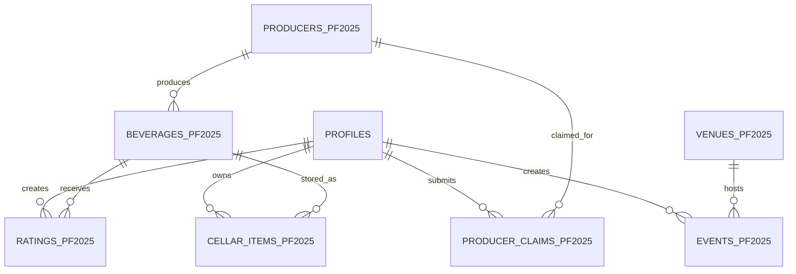

# Data model

NoCodeBackend is the active persistent data service. The full field, permission, and setup contract is maintained in [NoCodeBackend schema mapping](nocodebackend/schema-mapping.md); this document is an implementation-level map, not an executable schema.

## Entities and ownership
- `profiles` is keyed by the authenticated user id; its `type` drives administrative and producer-related roles.
- `producers_pf2025` owns producer catalogue metadata; `beverages_pf2025` records reference a producer.
- `ratings_pf2025` and `cellar_items_pf2025` belong to one authenticated user and reference a beverage.
- `producer_claims_pf2025` links a submitter to a producer and contains restricted review and sensitive verification fields.
- `venues_pf2025` and `events_pf2025` support venue ownership/manager and event-creator relationships.

## Constraints, lifecycle, and sensitive data
IDs are UUID/string values generated by NoCodeBackend or the relevant collection workflow. Mutable collections use `created_at` and `updated_at`; update the latter where NoCodeBackend does not automate it. Enforce ownership and admin permissions in NoCodeBackend, not only the client. Claim `tax_id`, business-license information, contact details, private cellar records, and account data require least-privilege access and must not be logged or copied into issues.

## Schema change process
There is no executable migration system in this repository. Before changing a collection, field, relationship, permission, or lifecycle rule: document the updated contract in the schema mapping, describe backwards compatibility and data backfill/rollout in the issue and PR, validate in a non-production NoCodeBackend environment, and obtain an ADR where the change is material. Do not run archived Supabase SQL.
