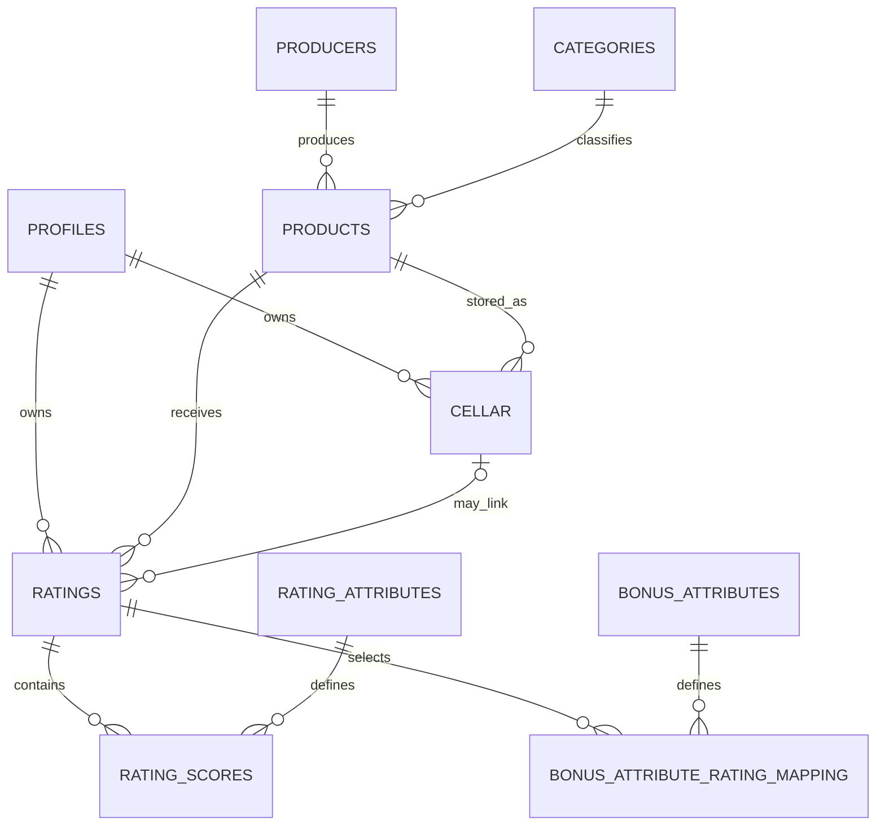

# Canonical NoCodeBackend schema mapping

## Status and evidence

This is the launch contract for the beer-first MVP. It is derived from:

- the supplied `54026_rating_export(2).sql` schema export;
- the supplied products, producers, categories, rating-attribute, bonus-attribute and cellar CSV exports;
- `Pourfolio_Beer_Ratings_Swagger_Payloads_With_Cellar(1)(1).xlsx`.

The obsolete `*_pf2025` collection names and `beverage_id` field are not part of this contract. `api/auth-proxy.js` is the authentication proxy, and `api/data-proxy.js` is the owner-enforcing application-data gateway through which the browser accesses these collections.

### Atomic-workflow verification (29 July 2026)

The connected runtime could not be interrogated: neither
`NOCODEBACKEND_DATA_BASE_URL` nor `NOCODEBACKEND_SECRET_KEY` is present in the
delivery environment, and the repository contains no provider transaction or
server-workflow endpoint/configuration. The available collection REST contract
exposes individual list/get/create/update/delete operations only. Consequently,
**atomic multi-collection transactions are not verified as supported** and the
gateway uses the idempotent reconciliation design below. This is deliberately
not a claim that the provider can never support transactions. Operations must
repeat this probe against the production-equivalent environment and may adopt a
single provider transaction only after its atomic commit/abort behaviour is
recorded with redacted API evidence.

The 29 July certification attempt is recorded in the
[rating workflow certification record](rating-workflow-certification.md). It was
blocked before remote requests because this environment still has neither
staging endpoint nor credential. No transaction has therefore been adopted.

### Conditional-update provider contract (4 August 2026)

A connected provider-contract probe sent an update with a stale
`expected_version`. NoCodeBackend returned HTTP `409` with the JSON envelope
`{"error":"<redacted provider stale-version message>"}` and did not expose a
separate machine-readable error code. The gateway therefore identifies this as
a version conflict only when the failed `409` belongs to a request carrying
`expected_version`; ordinary create/update uniqueness conflicts remain distinct,
and other upstream `4xx` statuses are preserved with safe application wording.

This response demonstrates the provider's stale-version error contract only. It
does **not** yet demonstrate that the rejected write was atomic or left the
record unchanged under concurrency. Compare-and-set support remains unverified
until a connected staging concurrency probe records the winning write, the
rejected stale write and the final persisted version.

## Collection summary

| Collection | Purpose | Ownership |
| --- | --- | --- |
| `profiles` | App-facing display profile for an authenticated account. | Owner read/write for editable display fields. |
| `products` | Product catalogue. | Authenticated read for MVP. |
| `producers` | Product producer catalogue. | Authenticated read for MVP. |
| `categories` | Product/style taxonomy. | Authenticated read for MVP. |
| `rating_attributes` | Applicable 1–7 score definitions and weights. | Authenticated read; administrative write outside MVP. |
| `bonus_attributes` | Optional rating bonus definitions. | Authenticated read; administrative write outside MVP. |
| `ratings` | Owner rating header, product reference, date and totals. | Owner create/read/delete; projected community read. |
| `rating_scores` | Normalised attribute scores for a rating. | Same owner as parent rating. |
| `bonus_attribute_rating_mapping` | Normalised optional bonus selections. | Same owner as parent rating. |
| `cellar` | Private user cellar inventory. | Owner CRUD only. |
| `brew_done_it_games` | Invitation and immutable two-participant game relationship. | Participants read; gateway-only create/update. |
| `brew_done_it_rounds` | Authoritative beer selection, roles, turn and completion state. | Participants read through a role-aware projection; gateway-only write. |
| `brew_done_it_guesses` | Immutable, ordered product guesses and server-awarded points. | Participants read through the game relationship; gateway-only create. |
| `brew_done_it_history_questions` | Minimal recognised-predicate boolean disclosures and per-round limit evidence. | No direct participant collection read; gateway-only create/read. |
| `blocked_relationships` | Directional account blocks consulted as a deny override. | Owner relationship management only; game gateway may test existence but never project rows. |

## Account export, deletion and retention status

The existing schema has no deletion-job, deletion-receipt, export-job,
verification-status or retention-control fields. None is implied by an editable
profile row, and no browser-supplied lifecycle status may be trusted. Whole-account
export and deletion are therefore not implemented against this contract.

The proposed owner-data boundary and dependency order are documented in the
[account lifecycle readiness review](../account-lifecycle-readiness.md). It
includes `profiles`, `ratings`, `rating_scores`,
`bonus_attribute_rating_mapping` and `cellar`; shared catalogue and attribute
definitions are not owner data and must not be deleted with an account.

Before implementation, a reviewed provider change must define a server-only,
idempotent deletion job/receipt store, write fencing, authentication identity
deletion, backup-expiry behaviour, permissions, indexes and rollback. Any job
record must contain only the minimum operational identifiers, state, timestamps
and aggregate counts—not exported personal-data bodies. This document must be
updated with the exact approved fields and relationships before persistence is
changed. Until then, the proposed retention periods are not production promises.

## Authoritative relationships

## Required fields

### `profiles`

`user_id` must be non-null, unique and match the immutable authenticated user
ID. The provider primary key may use the same identity. Editable browser fields
are limited to `name`, `description`, and `avatar_url`. Email, role, identity and
provider metadata are never accepted from a profile update.

### `products`

| Field | Rule |
| --- | --- |
| `id` | Positive integer primary key. |
| `product_name` | Required. |
| `product_category_id` | Optional `categories.id`. |
| `producer_id` | Optional `producers.id`. |
| `abv`, `ibu`, `declared_category`, `edition`, `collaboration`, `product_image` | Optional catalogue metadata. |

### `ratings`

| Field | Rule |
| --- | --- |
| `id` | Provider-generated primary key. |
| `user_id` | Non-null; set by the server from the authenticated session. |
| `rating_id` | Positive safe-integer client submission ID; non-null and unique with `user_id` for durable retry idempotency. |
| `product_id` | Non-null reference to an existing `products.id`. |
| `cellar_id` | Optional owner-held `cellar.id` for the same product. |
| `date_rated` | Non-null server timestamp; defaults on create and must not use `ON UPDATE CURRENT_TIMESTAMP`. |
| `total_unweighted`, `total_weighted` | Calculated by the server from normalised scores and current attribute weights. |
| `submission_key` | Non-null deterministic `<user_id>:<rating_id>` key; unique. |
| `submission_fingerprint` | Non-null SHA-256 digest of the canonical product, owner cellar, scores and bonus selection; never accepts client input. |
| `submission_state` | Non-null enum/string limited to `pending`, `complete`, or `failed`; server write only. |
| `submission_version` | Non-null non-negative integer, initially `0`; incremented exactly once by every conditional workflow-state transition. |
| `expected_score_count`, `expected_bonus_count` | Non-negative integers fixed from validated input and used to prevent premature duplicate success. |

The supplied database does not contain a rating-notes field. The launch form therefore does not pretend to persist review text. Adding notes requires an approved schema change and migration.

The provider must atomically compare `submission_version` with the supplied
`expected_version` while updating both `submission_state` and
`submission_version`. Permissions must restrict these fields to the privileged
data gateway and enforce only `pending -> failed` and `pending|failed ->
complete`; `complete` is terminal. Owner filters, fingerprint checks and a
pre-write read remain defence in depth, but must not replace the provider-side
compare-and-set. A version mismatch must return a conflict without changing the
record. Deploy and certify these fields and rules before deploying the gateway
change; existing non-production headers require a reviewed backfill to version
`0`.

### `rating_scores`

`user_id`, `rating_id`, `attribute_id` and `attribute_score` are non-null. Each
applicable scored attribute must occur exactly once per rating, enforced by a
unique `(rating_id, attribute_id)` constraint. Each row also has a non-null,
globally unique deterministic `uniqueness_key` of
`<user_id>:<client-rating_id>:score:<attribute_id>`. `attribute_score` is an integer
from 1 through 7 inclusive. Score `1` is valid and must not be treated as
missing. `user_id` is set by the server.

### `bonus_attribute_rating_mapping`

Bonus selections are optional. Each submitted `bonus_attributes_id` must exist.
When selected, `user_id`, `rating_id` and `bonus_attributes_id` are non-null and
the pair `(rating_id, bonus_attributes_id)` is unique. Each row also has a
non-null, globally unique deterministic `uniqueness_key` of
`<user_id>:<client-rating_id>:bonus:<bonus_attributes_id>`. `user_id` and `rating_id`
are set by the server.

### `cellar`

The gateway accepts the supplied schema fields through an explicit allowlist. `user_id` is always derived from the session. Quantities and monetary values cannot be negative.

`sharing_series_id` and `series_version_id` are optional. When not applicable they must be `NULL`; zero and fabricated identifiers are rejected. A rating does not require a sharing series or edition.

## Proposed Brew Done It persistent contract (not yet deployed)

This is a deliberately smaller three-collection model. Questions come only from
the separately reviewed controlled bank; free text is never accepted. The
versioned scoring details are in [the approved product contract](../PRODUCT.md#scoring-contract-v100).
No client route is part of this delivery.

### `brew_done_it_games`

| Field | Rule |
| --- | --- |
| `id` | Provider-generated positive primary key. |
| `selector_participant_id` | Non-null immutable authentication subject; always copied from the creating session. |
| `guesser_participant_id` | Immutable authentication subject set once by the gateway when a different authenticated user proves possession of the one-time invitation. Never accepted as a client field. |
| `invitation_digest` | SHA-256 digest of an opaque 256-bit HMAC-derived invitation; server-only, unique, cleared on join and never projected. |
| `status` | Server-only enum: `waiting`, `active`, `completed`, `forfeited`, `expired`, or `cancelled`. |
| `version` | Non-negative monotonic transition version. Every conditional mutation increments it exactly once. |
| `expires_at`, `cancelled_at`, `completion_reason` | Server deadlines and terminal audit fields. Waiting invitations may expire or be cancelled; active games may complete or be forfeited. |
| `creation_idempotency_key`, `join_idempotency_key`, `terminal_idempotency_key` | Server-scoped stable retry keys. Unique constraints include the authenticated actor; values are never projected. |
| `created_at`, `joined_at`, `completed_at` | Server timestamps; nullable only before the corresponding transition. |
| `selector_history_consent_at`, `guesser_history_consent_at` | Server timestamps written only after that authenticated participant submits literal `historyConsent: true`; both are required before questions. |

### `brew_done_it_rounds`

| Field | Rule |
| --- | --- |
| `id`, `game_id`, `round_number` | Provider primary key, non-null game reference and positive sequence; `(game_id, round_number)` is unique. MVP has one round. |
| `selector_participant_id`, `guesser_participant_id` | Non-null immutable copies of the game's authenticated participants. Provider constraints or a server workflow must prevent changes. |
| `selected_product_id` | Existing `products.id`, set once by the selector through the gateway; hidden from the guesser until completion. |
| `status` | Server-only enum: `awaiting_selection`, `guessing`, `completed`, `forfeited`, `expired`, or `cancelled`. No terminal round can transition again. |
| `version` | Non-negative monotonic turn version returned to both participants and required as `expectedVersion` on every mutation. |
| `selection_idempotency_key` | Actor-scoped stable retry key for the one selection transition; server-only and unique. |
| `turn_sequence`, `max_turns` | Server-owned non-negative current turn and immutable limit (six for MVP). |
| `question_count` | Server-owned count from 0 through 2 of controlled questions used in this round. |
| `created_at`, `started_at`, `completed_at` | Server timestamps. |
| `completion_reason` | Server-only nullable enum: `correct_guess` or `turn_limit`; required exactly when completed. |
| `scoring_rules_version`, `awarded_points`, `score_breakdown` | Required exactly when completed. The immutable semantic version, clamped authoritative total and itemised JSON award/penalty/question totals are calculated by the gateway and retained so historical results are never rewritten. |

### `brew_done_it_guesses`

| Field | Rule |
| --- | --- |
| `id`, `round_id` | Provider primary key and non-null round reference. |
| `guesser_participant_id` | Immutable copy of the designated guesser, derived from the round rather than the request. |
| `turn_sequence`, `uniqueness_key` | Consecutive positive turn and globally unique `<round_id>:<turn_sequence>` key; `(round_id, turn_sequence)` is also unique. |
| `guess_type` | Immutable enum restricted to `product`, `producer`, or `style`. |
| `guessed_reference_id` | Existing canonical ID in the collection selected by `guess_type`: `products`, `producers`, or `categories`. No labels are persisted or compared. |
| `is_correct`, `awarded_points` | Server-derived exact-product completion flag and itemised points (including an incorrect-guess penalty). The gateway reloads the selected product, catalogue relationships, maintained category hierarchy and prior guesses, then invokes scoring contract v1.0.0. |
| `created_at` | Immutable server timestamp. |
| `idempotency_key` | Stable actor-scoped request key, unique for the round and retained for retry reconciliation. |

### `brew_done_it_history_questions`

| Field | Rule |
| --- | --- |
| `id`, `round_id`, `question_sequence` | Provider primary key, parent round and consecutive sequence limited to two. |
| `predicate` | One of `both_rated_product`, `both_rated_producer`, `both_rated_style`, or `current_player_rated_product`; unique with `round_id`. |
| `uniqueness_key` | Globally unique `<round_id>:<predicate>` replay barrier. |
| `asked_by_participant_id` | Server-derived authenticated active participant; never accepted from the request. |
| `answer`, `answered_at` | Server-derived boolean and timestamp. No rating, product, score, date, cellar or unmatched-history data is copied here. |

`blocked_relationships` must provide indexed directional
`blocker_user_id`/`blocked_user_id` pairs. A matching pair in either direction
denies questions. Private profiles do not prevent a consented boolean, but
deleted ratings (including soft-deleted rows) and ratings whose `date_rated` is
at or after the round's immutable `started_at` do not count.

The finite state machine is `waiting -> active -> completed`, with
`waiting -> cancelled`, `waiting -> expired`, and `active -> forfeited` as the
only other game transitions. A round moves `awaiting_selection -> guessing ->
completed`, or follows its parent into the matching terminal cancellation,
expiry, or forfeiture state. Terminal states have no outgoing transitions.

The explicit application surface is `POST /brew-done-it/games`, `POST
/brew-done-it/games/:id/join`, `GET /brew-done-it/games/:id`, `POST
/brew-done-it/games/:id/cancel|expire|forfeit`, `POST
/brew-done-it/rounds/:id/selection`, `POST
/brew-done-it/rounds/:id/guesses`, `POST /brew-done-it/rounds/:id/history-questions`,
and `GET /brew-done-it/stats` below the
authenticated gateway. Arbitrary collection paths are never routed. The create
route makes the session user the selector; join accepts only the opaque
invitation, not an owner or participant ID. Every later operation reloads the
game relationship. Only the selector may select; only the immutable guesser may
guess; a completed round rejects every mutation. Game reads omit
`invitation_digest`; round reads omit `selected_product_id` for the guesser until
completion. Statistics count only authorised completed games/rounds and sum
each round's persisted versioned authoritative total; browser totals and
breakdowns are never accepted. Mutations require a 16–128 character stable
`idempotencyKey` and the last observed `expectedVersion`; stale and out-of-turn
requests receive a safe `409 VERSION_CONFLICT` with only the current version.
The gateway checks participant relationship, immutable role, FSM state,
expected version and question/turn limit before writing. Provider conditional
writes fence concurrent transitions, while persisted request keys reconcile a
retry after a response is lost. Completed-round statistics read the one
immutable round total, so request replay cannot add a second award.

The browser uses bounded refresh rather than introducing a real-time transport:
`brewDoneItService` polls no faster than once per second, defaults to two seconds
and 30 attempts, caps at 120 attempts, and stops on abort or a terminal game.

### Safe rollout and rollback

These routes must remain unreleased until the following manual provider change
is reviewed and evidenced because this repository has no executable migration
runner:

1. Back up the production-equivalent provider and prove restoration in staging.
   Create the three collections with foreign keys, enums, JSON support, non-null rules and
   immutable/server-only fields above. Apply unique constraints to invitation
   digests, `(game_id, round_number)`, `(round_id, turn_sequence)` and guess
   `uniqueness_key`. Add the question count, typed reference, scoring version,
   total and breakdown fields documented above. Do not enable the flag against
   the earlier draft schema; there is no safe in-place guess-reference backfill.
2. Implement or verify provider compare-and-set/server workflows for the
   `waiting` to `active`, selection, turn-increment and completion transitions.
   A plain read followed by an unconditional update is **not sufficient** for
   concurrent join or turn safety; production enablement is blocked without
   atomic conditional transitions.
3. Deny browser/provider-public access to all three collections. Permit only the
   gateway service identity, then exercise two simultaneous joins and guesses,
   replayed turns, role swaps, non-participants, forged scores and premature
   answer reads using redacted evidence.
4. Canary the gateway routes by setting the server-only
   `BREW_DONE_IT_POLICY_ENABLED=true` flag only after the preceding atomicity
   proof, reconcile counts and transition invariants, and then gradually enable
   traffic. With the flag absent or false, the gateway returns the same 404 as
   an unknown application route. There is no legacy backfill for this additive
   model.
5. For rollback, disable the flag first and retain the additive collections for
   investigation. Restore the prior gateway release; do not delete records or
   fields. After the retention decision and a redacted export, a separately
   approved provider operation may archive/drop empty collections. If corruption
   occurred, restore the backup and invalidate all outstanding invitations.

The provider rollout must also create the history-question collection and
consent fields above, enforce the two-question maximum atomically with question
creation, and add the block-pair index before enabling this endpoint. Completed
game, consent and question records are hard-deleted after 30 days; waiting games
after 24 hours; encrypted backups expire within a further 30 days. Retention
jobs must delete question rows before their parent round/game and record only
aggregate deletion counts. Rollback must disable the flag rather than dropping
retained evidence.

## Rating write lifecycle

1. Verify the authenticated server session.
2. Verify the product and optional owner cellar record.
3. Load scored rating attributes and bonus definitions.
4. Require exactly one 1–7 score for every applicable attribute.
5. Calculate authoritative weighted and unweighted totals.
6. Create or owner-safely load the header by unique `submission_key`; a conflict
   is a retry only when both ownership and `submission_fingerprint` match.
7. Create missing children by deterministic `uniqueness_key`. Treat a unique
   conflict as success only after loading the row through owner filters and
   validating its owner, parent and key.
8. Re-read every owner-scoped child, including its parent, attribute or bonus
   reference and score value. Mark the header `complete`, then re-read that
   owner-scoped header and return success only when the exact expected child
   sets and durable `complete` state match. Otherwise mark it `failed`; a
   failure to record that state is logged without owner data.
9. `POST /api/nocodebackend/ratings/reconcile` accepts the original submission
   body and performs this same owner-safe workflow. `submit` retries do likewise;
   both can resume `pending` or `failed` records after a timeout or partial write.
10. Return only projected public fields; never return fingerprints, deterministic
    keys, state internals, raw provider data, arbitrary owner IDs or secrets.

Launch-facing rating reads treat only durable headers whose `submission_state`
is `complete` as rating history. Product aggregates (both count and average),
`GET /api/nocodebackend/ratings/mine`, and participant-history checks exclude
`pending` and `failed` submissions. Reconciliation and operational workflow
lookups may read those incomplete states so that a safe retry can finish them.

Provider permissions must deny direct browser writes to all workflow fields and
collections. The gateway service identity may create/update rating workflow
fields and create children. Reads/updates used for reconciliation must require
the authenticated `user_id`; child foreign keys must reference `ratings.id`,
`rating_attributes.id`, and `bonus_attributes.id`. `ratings.cellar_id` must
reference `cellar.id`, while the gateway additionally enforces same owner and
product because a foreign key alone cannot express those rules.

## Schema preflight

Run the [rating schema preflight](schema-preflight.md) against a complete,
production-equivalent SQL export. The current supplied export is blocked because
the profile collection and required integrity controls are absent and
`date_rated` changes automatically on update.

## Required remote permission proof

Before public launch, test these cases in the production-equivalent NoCodeBackend instance:

| Actor | Expected |
| --- | --- |
| Unauthenticated | No access to application data endpoints. |
| Owner | CRUD own profile/cellar; create/read/delete own ratings. |
| Other user | Cannot read private cellar/profile fields or mutate another user’s records. |
| Authenticated catalogue user | Can read only projected product/producer/category/attribute data. |
| Administrator/provider secret | Can perform only the server workflows required by the gateway. |

Record screenshots or API transcripts with all secrets, cookies and personal data redacted.

## Rollout

There is no executable migration runner in this repository. Validate collection
paths, fields, filters, permission rules, create response shapes and rollback
behaviour in a non-production instance. Any persistent schema change requires an
approved provider migration and rollback path. Rehearse rollback and backup
restore before switching production traffic.

### Approved safe rollout for idempotent submissions

1. Back up the production-equivalent collections and rehearse restore. Pause
   rating writes during the constraint transition.
2. Add the five rating workflow fields and child `uniqueness_key` fields as
   nullable. Backfill stable submission keys, canonical fingerprints, expected
   counts and deterministic child keys with a reviewed, one-off provider job.
   Quarantine duplicate or incomplete legacy records for owner-safe review; do
   not guess winners.
3. Reconcile every backfilled header against its children, setting only exact
   matches to `complete` and all others to `failed`. Verify counts, ownership,
   parent relationships and key uniqueness from a redacted export.
4. Add unique constraints on `ratings.submission_key`,
   `rating_scores.uniqueness_key`, and mapping `uniqueness_key`, retain the
   existing composite uniqueness constraints, then make all workflow fields
   non-null and restrict state values.
5. Apply and prove the least-privilege permissions above in staging. Exercise
   concurrent requests, post-write timeouts, partial creation, conflicts,
   failed state updates, reconciliation and cross-owner cellar attacks before a
   canary deployment.
6. Roll back application traffic to the previous release only while retaining
   the additive fields. Removing constraints/fields requires a separately
   approved rollback after confirming no new submissions depend on them.
