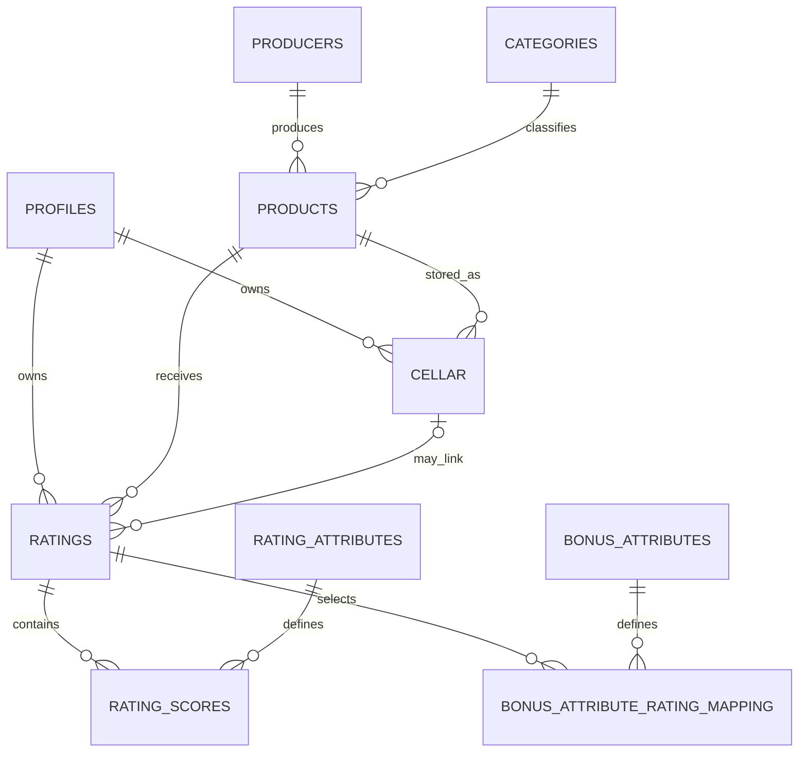

# Canonical NoCodeBackend schema mapping

## Status and evidence

This is the launch contract for the beer-first MVP. It is derived from:

- the supplied `54026_rating_export(2).sql` schema export;
- the supplied products, producers, categories, rating-attribute, bonus-attribute and cellar CSV exports;
- `Pourfolio_Beer_Ratings_Swagger_Payloads_With_Cellar(1)(1).xlsx`.

The obsolete `*_pf2025` collection names and `beverage_id` field are not part of this contract. The browser accesses these collections only through the authenticated application gateway in `api/nocodebackend/[...path].js`.

### Atomic-workflow verification (28 July 2026)

The connected runtime could not be interrogated: neither
`NOCODEBACKEND_DATA_BASE_URL` nor `NOCODEBACKEND_SECRET_KEY` is present in the
delivery environment, and the repository contains no provider transaction or
server-workflow endpoint/configuration. The available collection REST contract
exposes individual list/get/create/update/delete operations only. Consequently,
**atomic multi-collection transactions are not verified as supported** and the
gateway uses the idempotent reconciliation design below. This is deliberately
not a claim that the provider can never support transactions. Operations must
repeat this probe against the production-equivalent environment and may adopt a
single provider transaction only after its atomic commit/abort behaviour is
recorded with redacted API evidence.

## Collection summary

| Collection | Purpose | Ownership |
| --- | --- | --- |
| `profiles` | App-facing display profile for an authenticated account. | Owner read/write for editable display fields. |
| `products` | Product catalogue. | Authenticated read for MVP. |
| `producers` | Product producer catalogue. | Authenticated read for MVP. |
| `categories` | Product/style taxonomy. | Authenticated read for MVP. |
| `rating_attributes` | Applicable 1–7 score definitions and weights. | Authenticated read; administrative write outside MVP. |
| `bonus_attributes` | Optional rating bonus definitions. | Authenticated read; administrative write outside MVP. |
| `ratings` | Owner rating header, product reference, date and totals. | Owner create/read/delete; projected community read. |
| `rating_scores` | Normalised attribute scores for a rating. | Same owner as parent rating. |
| `bonus_attribute_rating_mapping` | Normalised optional bonus selections. | Same owner as parent rating. |
| `cellar` | Private user cellar inventory. | Owner CRUD only. |

## Authoritative relationships

## Required fields

### `profiles`

`user_id` must be non-null, unique and match the immutable authenticated user
ID. The provider primary key may use the same identity. Editable browser fields
are limited to `name`, `description`, and `avatar_url`. Email, role, identity and
provider metadata are never accepted from a profile update.

### `products`

| Field | Rule |
| --- | --- |
| `id` | Positive integer primary key. |
| `product_name` | Required. |
| `product_category_id` | Optional `categories.id`. |
| `producer_id` | Optional `producers.id`. |
| `abv`, `ibu`, `declared_category`, `edition`, `collaboration`, `product_image` | Optional catalogue metadata. |

### `ratings`

| Field | Rule |
| --- | --- |
| `id` | Provider-generated primary key. |
| `user_id` | Non-null; set by the server from the authenticated session. |
| `rating_id` | Positive safe-integer client submission ID; non-null and unique with `user_id` for durable retry idempotency. |
| `product_id` | Non-null reference to an existing `products.id`. |
| `cellar_id` | Optional owner-held `cellar.id` for the same product. |
| `date_rated` | Non-null server timestamp; defaults on create and must not use `ON UPDATE CURRENT_TIMESTAMP`. |
| `total_unweighted`, `total_weighted` | Calculated by the server from normalised scores and current attribute weights. |
| `submission_key` | Non-null deterministic `<user_id>:<rating_id>` key; unique. |
| `submission_fingerprint` | Non-null SHA-256 digest of the canonical product, owner cellar, scores and bonus selection; never accepts client input. |
| `submission_state` | Non-null enum/string limited to `pending`, `complete`, or `failed`; server write only. |
| `expected_score_count`, `expected_bonus_count` | Non-negative integers fixed from validated input and used to prevent premature duplicate success. |

The supplied database does not contain a rating-notes field. The launch form therefore does not pretend to persist review text. Adding notes requires an approved schema change and migration.

### `rating_scores`

`user_id`, `rating_id`, `attribute_id` and `attribute_score` are non-null. Each
applicable scored attribute must occur exactly once per rating, enforced by a
unique `(rating_id, attribute_id)` constraint. Each row also has a non-null,
globally unique deterministic `uniqueness_key` of
`<user_id>:<client-rating_id>:score:<attribute_id>`. `attribute_score` is an integer
from 1 through 7 inclusive. Score `1` is valid and must not be treated as
missing. `user_id` is set by the server.

### `bonus_attribute_rating_mapping`

Bonus selections are optional. Each submitted `bonus_attributes_id` must exist.
When selected, `user_id`, `rating_id` and `bonus_attributes_id` are non-null and
the pair `(rating_id, bonus_attributes_id)` is unique. Each row also has a
non-null, globally unique deterministic `uniqueness_key` of
`<user_id>:<client-rating_id>:bonus:<bonus_attributes_id>`. `user_id` and `rating_id`
are set by the server.

### `cellar`

The gateway accepts the supplied schema fields through an explicit allowlist. `user_id` is always derived from the session. Quantities and monetary values cannot be negative.

`sharing_series_id` and `series_version_id` are optional. When not applicable they must be `NULL`; zero and fabricated identifiers are rejected. A rating does not require a sharing series or edition.

## Rating write lifecycle

1. Verify the authenticated server session.
2. Verify the product and optional owner cellar record.
3. Load scored rating attributes and bonus definitions.
4. Require exactly one 1–7 score for every applicable attribute.
5. Calculate authoritative weighted and unweighted totals.
6. Create or owner-safely load the header by unique `submission_key`; a conflict
   is a retry only when both ownership and `submission_fingerprint` match.
7. Create missing children by deterministic `uniqueness_key`. Treat a unique
   conflict as success only after loading the row through owner filters and
   validating its owner, parent and key.
8. Re-read every owner-scoped child. Mark the header `complete` and return
   success only when exact expected key sets and counts match. Otherwise mark it
   `failed`; a failure to record that state is logged without owner data.
9. `POST /api/nocodebackend/ratings/reconcile` accepts the original submission
   body and performs this same owner-safe workflow. `submit` retries do likewise;
   both can resume `pending` or `failed` records after a timeout or partial write.
10. Return only projected public fields; never return fingerprints, deterministic
    keys, state internals, raw provider data, arbitrary owner IDs or secrets.

Provider permissions must deny direct browser writes to all workflow fields and
collections. The gateway service identity may create/update rating workflow
fields and create children. Reads/updates used for reconciliation must require
the authenticated `user_id`; child foreign keys must reference `ratings.id`,
`rating_attributes.id`, and `bonus_attributes.id`. `ratings.cellar_id` must
reference `cellar.id`, while the gateway additionally enforces same owner and
product because a foreign key alone cannot express those rules.

## Schema preflight

Run the [rating schema preflight](schema-preflight.md) against a complete,
production-equivalent SQL export. The current supplied export is blocked because
the profile collection and required integrity controls are absent and
`date_rated` changes automatically on update.

## Required remote permission proof

Before public launch, test these cases in the production-equivalent NoCodeBackend instance:

| Actor | Expected |
| --- | --- |
| Unauthenticated | No access to application data endpoints. |
| Owner | CRUD own profile/cellar; create/read/delete own ratings. |
| Other user | Cannot read private cellar/profile fields or mutate another user’s records. |
| Authenticated catalogue user | Can read only projected product/producer/category/attribute data. |
| Administrator/provider secret | Can perform only the server workflows required by the gateway. |

Record screenshots or API transcripts with all secrets, cookies and personal data redacted.

## Rollout

There is no executable migration runner in this repository. Validate collection
paths, fields, filters, permission rules, create response shapes and rollback
behaviour in a non-production instance. Any persistent schema change requires an
approved provider migration and rollback path. Rehearse rollback and backup
restore before switching production traffic.

### Approved safe rollout for idempotent submissions

1. Back up the production-equivalent collections and rehearse restore. Pause
   rating writes during the constraint transition.
2. Add the five rating workflow fields and child `uniqueness_key` fields as
   nullable. Backfill stable submission keys, canonical fingerprints, expected
   counts and deterministic child keys with a reviewed, one-off provider job.
   Quarantine duplicate or incomplete legacy records for owner-safe review; do
   not guess winners.
3. Reconcile every backfilled header against its children, setting only exact
   matches to `complete` and all others to `failed`. Verify counts, ownership,
   parent relationships and key uniqueness from a redacted export.
4. Add unique constraints on `ratings.submission_key`,
   `rating_scores.uniqueness_key`, and mapping `uniqueness_key`, retain the
   existing composite uniqueness constraints, then make all workflow fields
   non-null and restrict state values.
5. Apply and prove the least-privilege permissions above in staging. Exercise
   concurrent requests, post-write timeouts, partial creation, conflicts,
   failed state updates, reconciliation and cross-owner cellar attacks before a
   canary deployment.
6. Roll back application traffic to the previous release only while retaining
   the additive fields. Removing constraints/fields requires a separately
   approved rollback after confirming no new submissions depend on them.
